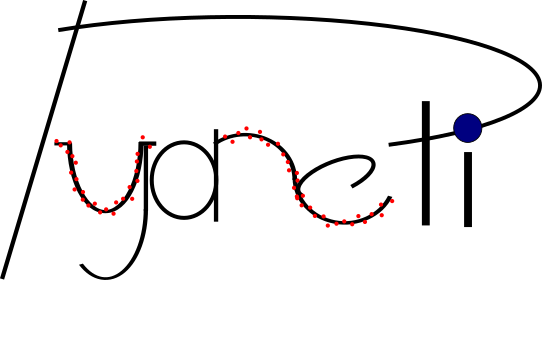
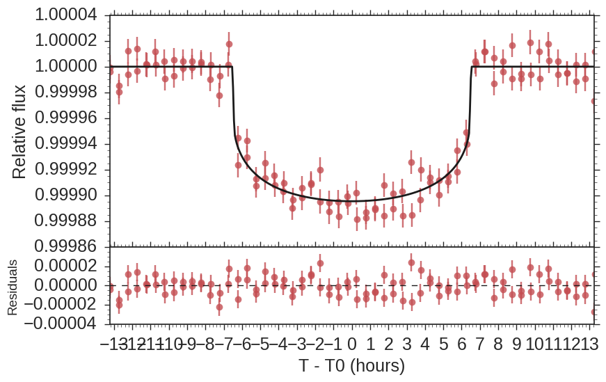
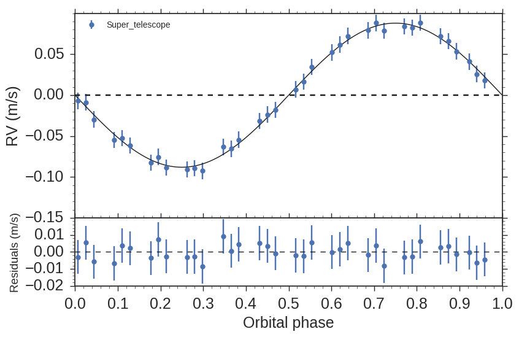

<p align="center">
  
</p>

# __pyaneti__
#### Written by Barragán O., Gandolfi D. & Antoniciello G.
##### email: oscaribv@gmail.com
##### Updated July 14, 2017

### __Introduction__

* _Pianeti_ is the Italian word for planets.
* Multi-planet fitting of radial velocity and transit data!
* It uses Marcov chain Monte Carlo (MCMC) methods with a Bayesian approach.
* Ensemble sampler with affine invariance algorithm
for a major coverage of the parameter space
([Godman & Weare, 2010](http://msp.org/camcos/2010/5-1/p04.xhtml)).
* _Python_ does the nice things: plots, call functions, printing, in/output files.
* _Fortran_ does the hard work: MCMC evolution, likelihood calculation, ensemble sampler evolution.
* Open-source code (GPL v 3.0).
* **Free and fast code with the robustness of _Fortran_ and the versatility of _Python_**.

## __Power of pyaneti__

* Multiple independent Marcov chains to sample the space parameters.
* Easy-to-use: it runs by providing only one input_fit.py file.
* Parallel computing with OpenMP.
* Automatic creation of posteriors, correlations, and ready-to-publish plots.
* Circular and eccentric orbits.
* Multi-planet fitting.
* Inclusion of RV and photometry jitter.
* Systemic velocities for multiple instruments.
* Stellar limb darkening [(Mandel & Agol, 2002)](http://iopscience.iop.org/article/10.1086/345520/meta#artAbst).
* Correct treatment of short and long cadence data ([Kipping, 2010](http://mnras.oxfordjournals.org/content/408/3/1758)).
* Single joint RV + transit fitting.

## Dependencies

* gfortran (or your favorite fortran compiler)
* OpenMP
* numpy
* matplotlib
* seaborn (optional)

We tested this code using Linux, including Fedora and Ubuntu. This code has not been tested on a MAC computer yet.
Nevertheless, it should work by changing the compilers inside the makefile.
## Start to use it now!

Just clone or download pyaneti.

```
git clone https://github.com/oscaribv/pyaneti
```

The advantage about cloning the repository is the possibility to follow the changes to this package easily with git pull (learn more about git
at [https://git-scm.com/](https://git-scm.com/)).

The next step is to enter the pyaneti folder and see what we can find inside it

```
cd pyaneti
ls
  LICENSE  src inpy  makefile  pyaneti.py  README.md
```

Now compile the code typing ``make``

```
make
```

If you have all the dependencies installed, the make procces should end without error.

Now you are ready to run the code for the first time! Just type


```
./pyaneti.py test
```

or

```
python pyaneti.py test
```

The program will start. You will see something like:

```
==============================
------------------------------
    INITIAL CONFIGURATION
------------------------------
Star           = test
No. planets    = 1
------------------------------
iter max       = 100000000
thin factor    = 1
nconv          = 500
nwalkers       = 100
------------------------------
fit RV         = [True]
fit Transit    = [True]
------------------------------
LC data        = free
cadence time   =  30.000 min
n rebinning    = 1
Stellar priors = [True]
------------------------------
  PLANET testb
------------------------------
        PRIOR RANGES
------------------------------
T0 = u[ 2448285.0500 , 2448285.1500 ]
P  = u[ 365.2060 , 365.3060 ]
ew1= f[ 0.0000 , 1.0000 ]
ew2= f[ 0.0000 , 1.0000 ]
b  = f[ 0.0000 , 1.0000 ]
a  = g[ 200.0000 , 250.0000 ]
rp = u[ 0.0000 , 0.1000 ]
K  = u[ 0.0000 , 0.0010 ]
------------------------------
 Other parameter priors
------------------------------
q1 = g[ 0.3464 , 0.0500 ]
q2 = g[ 0.2839 , 0.0500 ]
Super_telescope = u[ 21.0719 , 23.0721 ]
==============================
 CREATING RANDOM SEED
 CREATING CHAINS
 STARTING MCMC CALCULATION
 RV datapoints  =           36
 TR datapoints  =          112
 No. parameters =            8
 dof            =          140
 ==================================
      Chain statistics
 ==================================
 chain |  reduced chi^2
 best  :  943036.50
 worst : **********
 mean  : **********
 ==================================
 STARTING INFINITE LOOP!
 ==================================
      Chain statistics
 ==================================
 chain |  reduced chi^2
 best  :       0.95
 worst :       1.04
 mean  :       0.99
 ==================================
 ==================================
      PERFOMING GELMAN-RUBIN
       TEST FOR CONVERGENCE
 ==================================
 ==================================
 CHAINS HAVE NOT CONVERGED YET!
         500  ITERATIONS MORE!
 ==================================
 ==================================
      Chain statistics
 ==================================
 chain |  reduced chi^2
 best  :       0.95
 worst :       1.06
 mean  :       0.98
 ==================================
 ==================================
      PERFOMING GELMAN-RUBIN
       TEST FOR CONVERGENCE
 ==================================
 ==================================
       CHAINS HAVE CONVERGED
 ==================================
    CREATING OUTPUT DATA FILES
 ==================================
STARTING CHAIN CLUSTERING
Initial number of chains: 100
Final number of chains: 100
--------------------------------------------------------------
Summary:
N_chains         =      100
N_conv           =      500
thin_factor      =        1
N_rv_data        =       36
N_tr_data        =      112
N_data           =      148
N_pars           =        8
chi2_rv          = 7.2796
chi2_tr          = 126.0172
chi2             = 133.2969
dof              =      140
chi2/dof         = 0.9521
ln likelihood_rv = 377.7437
ln likelihood_tr = 1131.1652
ln likelihood    = 1508.9089
BIC              = -2977.8400
AIC              = -3001.8177
--------------------------------------------------------------
             INPUT STELLAR PARAMETERS
--------------------------------------------------------------
M_*     = 1.0000000 - 0.1000000 + 0.1000000 solar masses
R_*     = 1.0000000 - 0.1000000 + 0.1000000 solar radii
T_*     = 5600.0000000 - 100.0000000 + 100.0000000 K
--------------------------------------------------------------
                   Parameters test b
-------------------------Fitted-------------------------------
T0   = 2448285.0952047 - 0.0030989 + 0.0036668  days
P    = 365.2507078 - 0.0044977 + 0.0051273  days
ew 1 = 0.0000000 - 0.0000000 + 0.0000000
ew 2 = 0.0000000 - 0.0000000 + 0.0000000
b    = 0.0000000 - 0.0000000 + 0.0000000
a/R* = 215.5095782 - 2.1950123 + 2.2800392
Rp/R*= 0.0093239 - 0.0000732 + 0.0000738
K    = 0.0881875 - 0.0024187 + 0.0023246  m/s
-------------------------Derived------------------------------
e    = 0.0000000 - 0.0000000 + 0.0000000
w*   = 0.0000000 - 0.0000000 + 0.0000000  deg
i    = 90.0000000 - 0.0000000 + 0.0000000  deg
a    = 1.0033630 - 0.1007987 + 0.1003419  AU
rho* = 1.4192642 - 0.0428860 + 0.0455435  g/cm^3 (transit light curve)
rho* = 1.4022235 - 0.3684160 + 0.5504695  g/cm^3 (input stellar parameters)
Mp   = 0.9848396 - 0.0710983 + 0.0709919 M_earth
Rp   = 1.0182951 - 0.1019236 + 0.1013548 R_earth
rho_p= 5.1101641 - 1.3021249 + 1.9699871  g/cm^3
g_p  = 937.9451796 - 30.4924730 + 30.1070802  cm/s^2
Tperi= 2448193.7824213 - 0.0038910 + 0.0046179  days
Teq  = 269.7885649 - 5.0357169 + 5.0234125  K (albedo=0)
T_tot= 13.0682012 - 0.1363547 + 0.1341594  hours
T_full= 12.8271319 - 0.1350366 + 0.1322223  hours
--------------------------------------------------------------
--------------------  Other parameters -----------------------
q1    = 0.3720423 - 0.0404674 + 0.0449115
q2    = 0.3180659 - 0.0461175 + 0.0464349
u1    = 0.3879422 - 0.0580690 + 0.0562684
u2    = 0.2223431 - 0.0601434 + 0.0599410
Super_telescope = 22.0719863 - 0.0000016 + 0.0000017 km/s
--------------------------------------------------------------
```
If you see this output it means that pyaneti ended succesfully!

Now let us check the plots.

```
evince outpy/test_out/testb_tr.pdf outpy/test_out/testb_rv.pdf

```

You will see some nice plots that look like this





Let me explain you briefly what this test fit was about:
> If you were an advanced alien civilization with really high technology, and "lucky" enough to see an Earth-like planet crossing in front of a Sun-like star, **this is how the Earth would look like to you**.

Look at those well-known parameters:
* 1 Earth Mass
* 1 Earth radii
* Period of 365 days
* 1 AU semi-major axis
* Density of ~5.5 g/cm^2,
* Gravity of ~10 m/s^2.

Of course you would need a spectograph with a precision of a few cm/s and also a very nice photometer.

> If you are at this point, you learned two things. First, with good data you can obtain really nice planet parameters and second, you learned how to run pyaneti.


## Documentation

#### Play with _test_ - Joint radial velocity and transit light curve fitting.

* There is a directory called _inpy_, inside this folder you will find a second directory called _test_.

* This directory constains the input and data files to perform the test fit.

* You can create an input director inside _inpy_ for each of your systems!

* We encorauge you to start to play with the code.

Create your own test directory and copy all the files from _inpy/test_ folder.

```
mkdir inpy/my_test
cp inpy/test/* inpy/my_test
```

Now you are ready to run _my_test_

```
./pyaneti.py my_test
```

You will see an output similar to that the _test_ case.
Now the output files are inside _outpy/my_test_out_. You will notice that inside this
directory you will find a extra file with the posterior distribution and correlation plots of the fitted parameters.

Now open the file _inpy/my_test/input_fit.py_ and start to play with it. The file is comented.
Let us change the priors for some parameters. Uncomment lines 56, 91 and 92
to fit for the scaled semi-major axis and impact factor. Save the changes and
re-run the code.

```
./pyaneti.py my_test
```

Now you can see that the fitted parameters are different in comparison with
the values given by _test_.

If you have some RV and/or transit data you only have to put the name
of your data files, change the prior ranges, and start to fit your data!

#### Parallel run

Run the code in parallel is really easy.

Just compile the code in parallel (you need openMP installed).

```
make para
```

if you have all the libraries installed, the compilation should finish without any problem.
Now you only need to run the code.

```
./pyaneti.py test
```

This option will run the code with all the processors available in your computer.
If you want to specify the number of CPUs to be use by _pyaneti_, you have to run the
env OMP_NUM_THREADS=N option, where N is the number of CPUs.

```
env OMP_NUM_THREADS=2 ./pyaneti.py test
```


**More documentation will come soon!**


## Science  with pyaneti


* Gandolfi et al., 2017, _The transiting multi-planet system HD3167: a 5.7 MEarth Super-Earth and a 8.3 MEarth mini-Neptune_,
AJ. (https://arxiv.org/abs/1706.02532)
* Guenther et al., 2017, _K2-106, a system containing a metal rich planet and a planet of lower density_,
A&A, submitted. (https://arxiv.org/abs/1705.04163).
* Fridlund et al., 2017, _EPIC 210894022b - A short period super-Earth transiting a metal poor, evolved old star_,
A&A, in press. (https://arxiv.org/abs/1704.08284).
* Barragán et al., 2017, _EPIC 218916923 b: a low-mass warm Jupiter on a 29-day orbit transiting an active K0V star_,
MNRAS, submitted (https://arxiv.org/abs/1702.00691).
* Nespral et al., 2017, _Mass determination of K2-19b and K2-19c from radial velocities and transit timing variations_,
A&A, 601A, 128.  (http://arxiv.org/abs/1604.01265).
* Nowak et al., 2017, _EPIC 219388192 b - an inhabitant of the brown dwarf desert in the Ruprecht 147 open cluster_,
 AJ, 153, 131 (https://arxiv.org/abs/1610.08571).
* Eigmüller et al., 2017, _K2-60b and K2-107b. A sub-jovian and a jovian planet from the k2 mission_,
AJ, 153, 130 (https://arxiv.org/abs/1611.03704).
* Barragán et al, 2016, _K2-98b: A 32-M⊕ Neptune-sized planet in a 10-day orbit transiting an F8 star_,
 AJ, 152, 6 (http://arxiv.org/abs/1608.01165).

## What will come next?

* Gaussian process.
* TTV.
* Multiband transit photometry fitting.
* Graphical User Interface.


**If you have any comments, requests, suggestions or just need any help, please don't think twice, just contact us!**

##

#### Warning: This code is under developement and it may contain bugs. If you find something please contact us at oscaribv@gmail.com

## Acknowledgements
* Hannu Parviainen, thank you for helping us to interpret the first result of the PDF of the MCMC chains. We learned a lot from you!
* Salvador Curiel, thank you for  suggestions to parallelize the code.
* Mabel Valerdi, thank you for being the first _pyaneti_ user, for spotting typos and errors in this document. And thank you much for the awesome idea for pyaneti's logo.
* Lauren Flor, thank you for testing the code before release.

**THANKS A LOT!**

