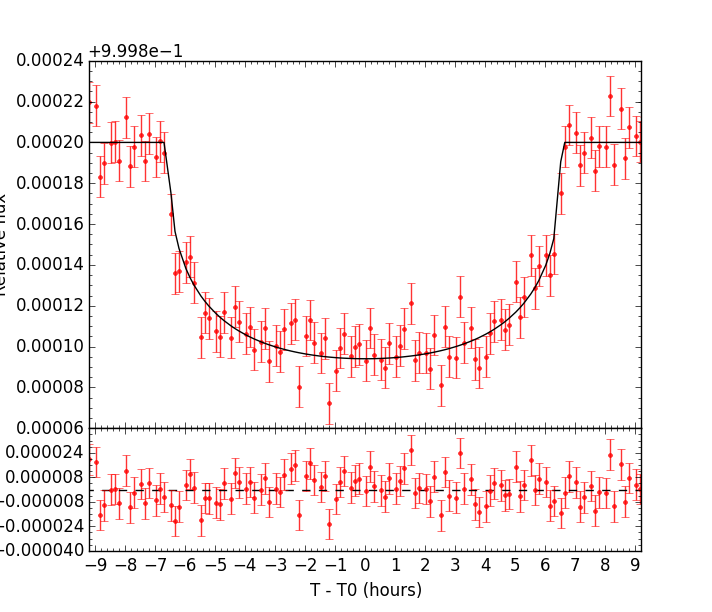
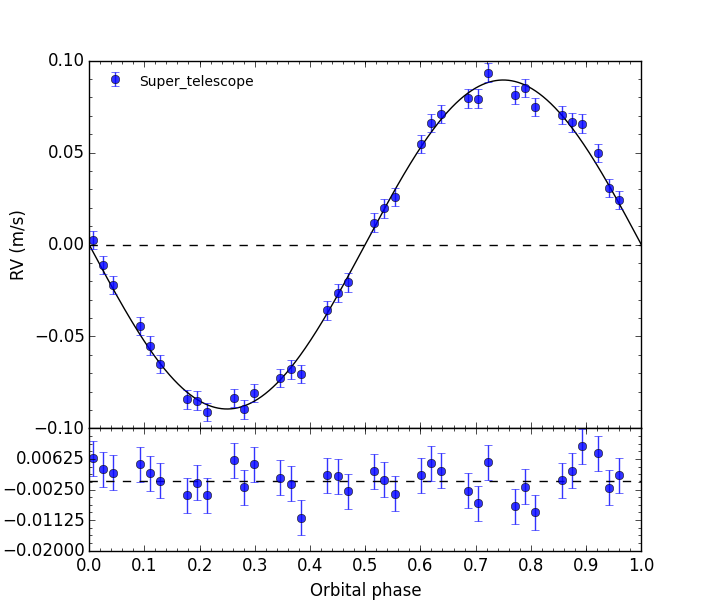

# __pyaneti__
#### Written by Barragán O. et al. 2016
##### email: oscaribv@gmail.com
##### Updated Jun 29, 2016

### __Introduction__

* _Pianeti_ is the Italian word for planets.
* It is a _python/fortran_ software suite which finds the best fitting solution using Marcov Chain Monte Carlo (MCMC) methods.
* Ensemble sampler with affine invariance algorithm
for a major coverage of the parameter space
([Godman & Weare, 2010](http://msp.org/camcos/2010/5-1/p04.xhtml)).
* _Python_ does the nice things: Plots, call to functions, prints, input files.
* _Fortran_ does the hard work: MCMC evolution, $\chi^2$ calculation, ensemble sampler evolution.
* Open-source code (GPL v 3.0). No need to pay!
* ** Free and fast code with the robustness of _Fortran_ and the versatility of _Python_ **.

## __Power of pyaneti__

* Multiple independent Marcov Chains to sample the space parameters.
* Easy-to-use: it runs by providing only one input_fit.py file.
* Automatic creation of histograms, correlations, and ready-to-publish plots.
* Circular and elliptical orbits.
* RV multi-planet fitting.
* Systemic velocities for multiple instruments in RV fittings.
* Stellar limb darkening [(Mandel & Agol, 2002)](http://iopscience.iop.org/article/10.1086/345520/meta#artAbst).
* Correct treatment of short and long cadence data ([Kipping, 2010](http://mnras.oxfordjournals.org/content/408/3/1758)).
* Single and joint RV-transit fits.

## ** Dependencies **

You need to install in your computer:
* gfortran
* numpy
* matplotlib

## ** Start to use it now! **

You do not need install anything, just clone or download pyaneti.

```
git clone https://github.com/oscaribv/pyaneti
```

The advantage about cloning the repository is the possibility to follow the changes to this package easily with git pull (learn more about git
in [https://git-scm.com/](https://git-scm.com/)).
Or if you want

```
wget https://github.com/oscaribv/pyaneti/archive/master.zip
unzip master.zip
mv pyaneti_master pyaneti
```

if you choose this option, you should repeat it every time the code is updated.

The next step is to get inside the pyaneti folder and see what we can find inside it

```
cd pyaneti
ls
  LICENSE   outpy  src inpy  makefile  pyaneti.py  README.md
```

 type ``make``, you would see a lot of text apearing in the terminal, after it finishes, you are done!

```
make
```

If you have all the dependencies installed, the make procces ended without any error.
Now you are ready to run the code for the first time.

```
./pyaneti.py test
```

or

```
python pyaneti.py test
```

The program will start. You will see a lot of things appearing on your screen, ignore them now. Wait a couple of minutes and then you should see something like:

```
Summary:
N_chains    =       50
N_conv      =      500
thin_factor =       10
N_data      =      174
N_pars      =        8
chi2        = 170.0005
DOF         =      166
chi2_red    = 1.0241
scale factor= 0.9882
BIC         = 211.2729
Input parameters
M_*     = 1.0000000 + 0.0000000 - 0.0000000 solar masses
R_*     = 1.0000000 + 0.0000000 - 0.0000000 solar radii
T_*     = 5599.9977502 + 99.6288025 - 99.0780787 K
The best fit planet parameters are:
T0    = 2448285.0915491 + 0.0008446 - 0.0007696 days
P     = 365.2553268 + 0.0006308 - 0.0006627 days
e     = 0.0000 + 0.0000 - 0.0000     
w     = 90.0000 + 0.0000 - 0.0000 deg
Transit fit parameters:
i     = 89.9858 + 0.0082 - 0.0093 deg
a/r*  = 215.0315 + 0.0002 - 0.0003
rp/r* = 0.0092 + 0.0000 - 0.0000
q_1    = 0.3464 + 0.0200 - 0.0220
q_2    = 0.2839 + 0.0288 - 0.0288
RV fit parameters:
alpha = 0.0000e+00 + 0.0000e+00 - 0.0000e+00
beta  = 0.0000e+00 + 0.0000e+00 - 0.0000e+00
K     = 0.0893 + 0.0008 - 0.0008 m/s
S v0  = 22.0720 + 0.0000 - 0.0000 km/s
Derived parameters:
r_p   = 1.0018 + 0.0017 - 0.0016 R_earth
a   = 1.0000 + 0.0000 - 0.0000  AU
b r*  = 0.0533 + 0.0348 - 0.0306
t_total = 13.0772 + 0.0150 - 0.0315 hours
t_in/eg = 0.1193 + 0.0005 - 0.0003 hours
rho_* = 1.4098 + 0.0000 - 0.0000 g/cm^3
u_1    = 0.3336 + 0.0254 - 0.0271
u_2    = 0.2545 + 0.0407 - 0.0405
T_eq   = 270.0361 + 4.8617 - 4.8350K
Tp    = 2448285.0915 + 0.0008 - 0.0008 days
mp    = 0.9981 + 0.0091 - 0.0087 earth masses
rho_p = 5.4540 + 0.0571 - 0.0534 g/cm^3
g_p = 974.3174 + 9.4863 - 8.9293 cm/s^2
```
Once see this, you will see some plots similar to





Let me explain you briefly what this is:
> If you were an advanced alien civilization with really high technology, and "lucky" enough to see the Earth crossing in front of the Sun, **this is how the Earth would look like to you**.

Look at those well known parameters:
* 1 Earth Mass
* 1 Earth radii
* Period of 365 days
* 1 AU semi-major axis
* Density of 5.5 g/cm^2,
* Gravity of 10 m/s^2.  

Of course you would need a spectograph with a precision of a few cm/s and also a very nice photometer.

> If you are at this point, you learned two things. First, with good data you can obtain really nice planet parameters and second, you learned how to run pyaneti.  


## ** Create your own setup **
_Work in progress!_

## ** Documentation **

_Work in progress!_

## ** Science  with pyaneti **
* Nespral et al., 2016, _Mass determination of K2-19b and K2-19c from radial velocities and transit timing variations_, A&A, submitted, (http://arxiv.org/abs/1604.01265)
* Barragán et al, 2016, _EPIC 211391664b: A 32-M⊕ Neptune-sized planet in a 10-day orbit transiting an F8 star_, AAS, submitted, (http://arxiv.org/abs/1608.01165)

## ** Acknowledgements **
* to Davide Gandolfi, for his support and motivation to create this code.
* to Hannu Parviainen, to help me to interpret the first result of the PDF of the MCMC chains. I learned a lot!
* to Mabel Valerdi, to help me with as the first pyaneti user, to detect bugs and errors in this manual. As well for its idea for the pyaneti's logo.
* to Salvador Curiel, for his suggestions to parallelize the code.

**THANKS!**
